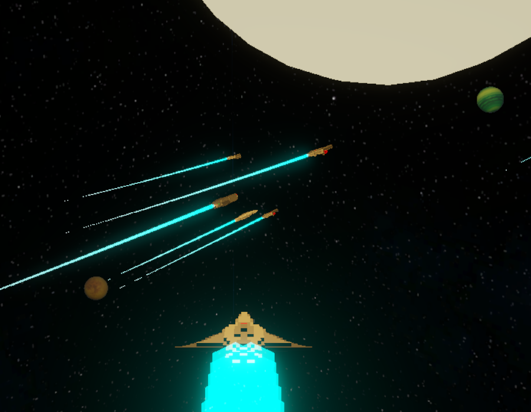

# Easebeyond



**A quiet journey through drifting stars.**

Easebeyond is a small space experience where you can look across a calm stellar field and enjoy the atmosphere of deep space.

## Play

[Launch Easebeyond](https://easebeyond.com/)

## About

- Minimal space-themed interactive scene
- Calm, atmospheric presentation
- Designed to run directly in the browser

## Project

This repository contains the deployment-ready website and Unity WebGL build for Easebeyond.

- `index.html`: GitHub Pages entry point
- `site/page.template.html`: shared localized page template
- `site/locales.json`: localized titles and descriptions
- `scripts/generate-pages.mjs`: page and sitemap generator
- `Build/`: Unity WebGL build and runtime assets
- `image/`: website metadata and README images

The site is published through GitHub Pages and can be refreshed by replacing the contents of `Build/` with a new WebGL build.

## Localized pages

Edit `site/page.template.html` for shared layout changes or `site/locales.json` for translations, then regenerate every localized page and the sitemap:

```sh
npm run generate
```

Generated `index.html` files should not be edited directly. GitHub Actions checks that generated pages remain synchronized.
